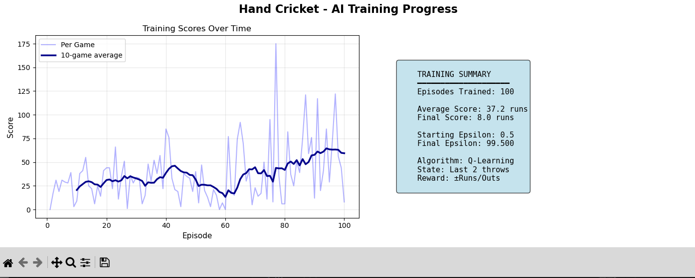
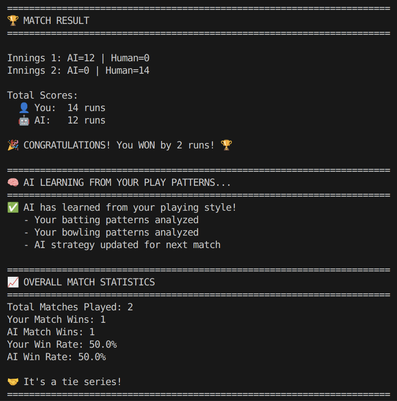

# 🏏 Hand Cricket AI — Q-Learning Powered Interactive Game

### **A Reinforcement Learning project where an AI learns to play Hand Cricket using Q-Learning.**

<p align="center">
  
  
  
</p>

---

## 📌 Overview

This project implements an **Interactive Hand-Cricket game** where you can play against an AI agent trained using **Q-Learning**.
The system includes:

✔ Human vs AI gameplay
✔ Coin toss system
✔ Multi-wicket (lives) cricket logic
✔ Q-learning–based batting & bowling agents
✔ AI training from both simulated and real human play
✔ Performance visualization using Matplotlib

The agent learns through repeated matches, updating its Q-table using the Bellman equation, eventually developing strategic batting or bowling behaviors.

---

## 🎮 Game Modes

### **1️⃣ Training Mode**

The AI trains for 100 simulated matches each for batting and bowling.
It adapts by learning against biased and random throw patterns.

### **2️⃣ Interactive Play Mode**

You play a full 2-innings cricket match against the trained AI.

* Odd/Even coin toss
* Batting & bowling turns
* AI learns from your playing style after every match
* Match statistics and win rates displayed

---

## ✨ Features

### 🧠 Q-Learning AI

* Tabular Q-table
* ε-greedy exploration
* Last two human throws used as the game state
* Reward shaping for runs / outs
* Epsilon decay for stable learning

### 🏏 Cricket Mechanics

* Realistic hand-cricket rules
* Multi-wicket lives
* Score accumulation
* Matching numbers = OUT
* Chasing target in second innings

### 📊 Visualizations

* Training score progression
* Moving average graphs
* Summary statistics

---

## 🔧 Tech Stack

* **Python 3.9+**
* **NumPy** (Q-table & math)
* **Matplotlib** (visualization)
* **Random** (opponent simulation)
* **Defaultdict** (Q-table storage)

---

## 🏗️ Project Structure

```
📁 Hand-Cricket-Q-Learning
│
├── game.py                      # Full game + training loop
├── HandCricketEnv               # Environment (runs, outs, wickets)
├── QLearningAgent               # AI agent logic
├── training_stats_plotter       # Matplotlib visualizer
│
└── README.md                    # You are here!
```

---

## 🚀 How It Works

### **🟥 1. Environment (`HandCricketEnv`)**

Handles:

* Runs
* Wickets
* Outs
* Scoring rules
* Game-over status

Throws are compared every round:

```
if batting_throw == bowling_throw → OUT  
else → runs = abs(batting_throw - bowling_throw)
```

---

### **🟦 2. State Representation**

The agent uses:

```
(last_throw_1, last_throw_2)
```

Keeps state small & efficient.

---

### **🟩 3. Q-Learning Update Rule**

[
Q(s,a) ← Q(s,a) + α [ r + γ \max Q(s',a') - Q(s,a) ]
]

Rewards:

* Bowling AI → Reward for OUT, penalty for runs
* Batting AI → Reward for runs, penalty for out

---

### **🟨 4. Action Selection (ε-Greedy)**

```
if random < ε:
    choose random move        # exploration
else:
    choose best Q-value move  # exploitation
```

ε decays every episode.

---

### **🟪 5. Training Loop**

✔ 100 episodes of simulated human play
✔ Biased/random human throws
✔ Q-table updated every ball
✔ Training summary printed every 20 episodes

---

## 📈 Training Visualization

After training, a 2-panel Matplotlib graph is generated:

* Episode vs Score
* Moving average
* Training summary box
* Final EPSILON value
* Q-Learning parameters





---

## 🎮 How to Play

### ✔ Step 1: Clone repo

```bash
git clone https://github.com/kshitijkhanka24/Hand-Cricket-RL
cd Hand-Cricket-RL
```

### ✔ Step 2: Install requirements

```bash
pip install numpy matplotlib
```

### ✔ Step 3: Run game

```bash
python game.py
```

### ✔ Step 4: Play a Match After Training

The program asks:

```
Want to play against the AI? (yes/no):
```

Then enjoy two full innings!

---

## 🏆 Example Gameplay (Terminal)



---

## 📚 References

* GeeksforGeeks — Q-Learning (2025)
* freeCodeCamp — RL Tic-Tac-Toe Tutorial (2025)
* Wikipedia — Q-Learning (accessed 2025)
* Shubham Arya — Hand Cricket Game Explanation
* Autodesk Instructables — Hand Cricket Rules

---

## 💡 Future Improvements

* Neural Network (Deep Q-Learning)
* Pattern-based opponent modeling
* GUI Version (Tkinter / Pygame)
* Multiplayer online mode
* Variable overs & cricket formats

---

## 🤝 Contributing

Pull requests are welcome!
Open an issue to report bugs or propose ideas.

---

## ⭐ Show your support

If you found this project useful, please ⭐ star the repo!

---
